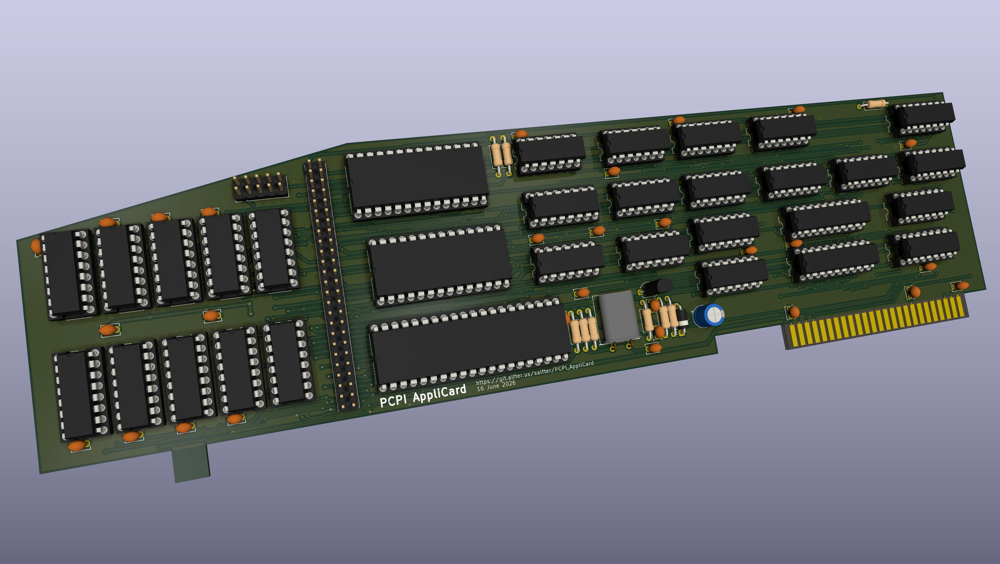

# PCPI AppliCard

This is a clone of the PCPI AppliCard, a Z80 coprocessor card for the Apple II.
I've previously captured the [Microsoft Softcard](https://git.alfter.us/salfter/Microsoft_Softcard),
a simpler Z80 board that uses the Apple II's memory.  This board has its own
64K (expandable to 192K) connected directly to the Z80 and running at the same
speed.

The schematic was captured from published sources.  The PCB layout is based on
the component layout shown in a photo of the original board, but the connections
between components are my own work.  The new PCB, like the original, is a 2-layer
design.

I've not had a chance to build this.  DRC tells me the PCB matches the schematic.
I think my schematic capture is correct, but I don't have a working PCB to compare
against, so **use this at your own risk**.

